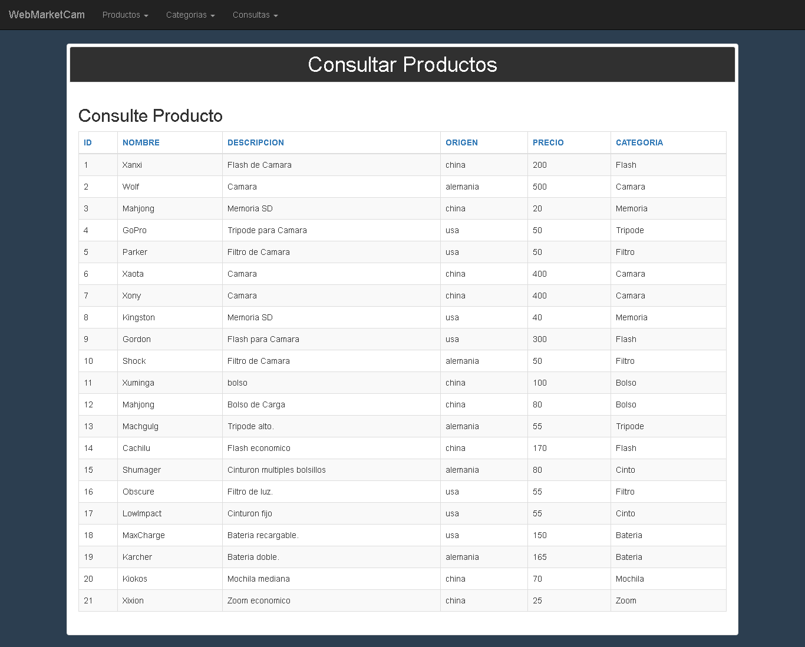

# Proyecto Bios

Proyecto de entrega para instituto BIOS de programación web con PHP y MySQL.

## De que trata?

Es un Sistema de gestion para importadora de articulos de fotografia.
Permite ingresar, listar, modificar y eliminar productos.
El mismo utiliza en front end jQuery y Bootstrap para un diseño más agradable, php de lado de servidor para generar las paginas y mysql para la persistencia de datos.

## Como implementarlo?

Puedes forkear este repositor y clonarlo en tu propia maquina, sera necesario instalar XAMP para poder levantar un servidor apache y mysql en tu maquina.
Para las bases de datos se uso el gestor HeidiSQL.
En la carpeta sql se encuentra una imagen de la base de datos para importar.

Pienso a futuro proximo subirlo a la nube con  heroku.

## Como funciona?
Una vez todos los archivos esten en la maquina, los servicios abiertos, ingresar al localhost y el index.php tiene menu para todas las opciones.

En Productos se podra dar de alta, de baja o modificar un producto.
En Categorias se puede dar de alta  o modificar una categoria.
En Consultas puedes ver todos los productos o filtrar por Categoria.

## Que aprendi de este proyecto?
Sin lugar a duda, uno puede creer saber algo hasta el momento que hay que sentarse a desarrollar un programa entero.
En los ultimos meses aprendí  varios lenguajes de programación nuevos y PHP fue uno que le preste menos atención ultimamente, costo un poco utilizarlo  de nuevo.

Fue una buena manera de refrescar conocimientos, además diseñar e implementar la base de datos me fue de gran utilidad para el obligatorio de  Bases de Datos 1 en la ORT.

## Que me gustaria mejorar del proyecto?
1. Creo que seria implementar una gestion de sesion de usuario.
2. Implementar mejoras en la interface del usuario como un campo de search.
3. Reformular mucho del codigo php y javascript, de manera que este màs ordenado.

### Gracias!!!